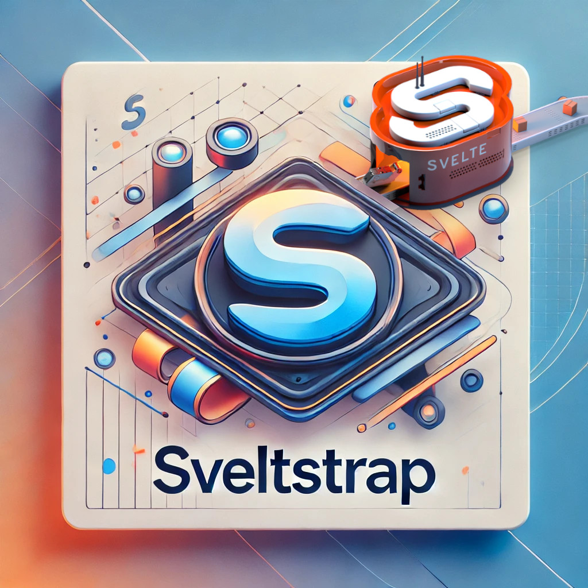

# SveltStrap - A Svelte 5 SaaS Boilerplate

### Features ✨

- 🧩 **Component Based** - Built with reusable components using Svelte's powerful component system for maximum flexibility and maintainability.
- 🎨 **Modern Styling** - Powered by TailwindCSS and shadcn-svelte for beautiful, responsive, and customizable designs.
- 🧪 **Full Test Suite** - Comprehensive testing with ViTest for unit tests, Playwright for E2E, and Storybook for component testing.
- 📈 **Scalable As Standard** - Built with scalability in mind, featuring a well-organized structure and best practices for growing applications.

### Getting Started 🚀

#### Local Development

- Run `pnpm install`
- Rename the `.env.example` file to `.env` and **populate it with your own values**
- run `npm run dev`

#### Production 🌐

- 🌍 Get a domain name
- 🏗️ Set up a project from this repo on **Vercel**: [vercel](https://vercel.com)
- 🎯 Point your main domain name to your project on Vercel
- 🔐 fill out the environment variables in `.env`
- ⚙️ Add those environment variables to your project in Vercel

Feel free to contribute or suggest improvements! 🤝

### Credits 🙏

This project was inspired by [Just Ship](https://www.justship.today/), a fantastic resource for shipping side projects quickly and efficiently. Check them out for more inspiration and guidance on building and launching your own projects!

